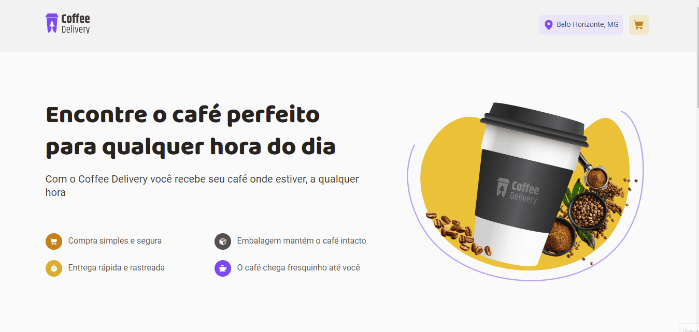

# Coffee Delivery

Este projeto de desafio me ajudou a praticar todo o meu conhecimento de React Context API, Formularios Controlados é não controlados, React Hook Form, React Router DOM e zod. Abaixo está um preview do deploy.

[Clique aqui para abrir o site de visualização](https://coffee-delivery-filipedev6.vercel.app/)

## 🚀 Tecnologias

Esse projeto foi desenvolvido com as seguintes tecnologias:

- ReactJS
- TypeScript
- Styled-Components
- React Router
- React Hook Form
- Zod
- [Node e NPM](https://nodejs.org/)
- [Vite](https://vitejs.dev/)

Foi preciso rever conceitos como:

- Estados
- ContextAPI
- LocalStorage
- Imutabilidade do estado
- Listas e chaves no ReactJS
- Propriedades
- Componentização